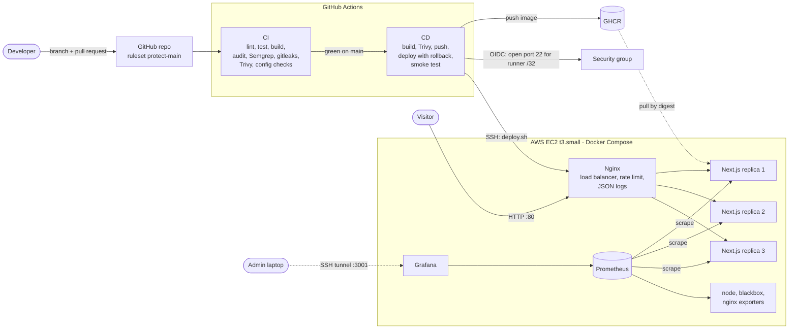
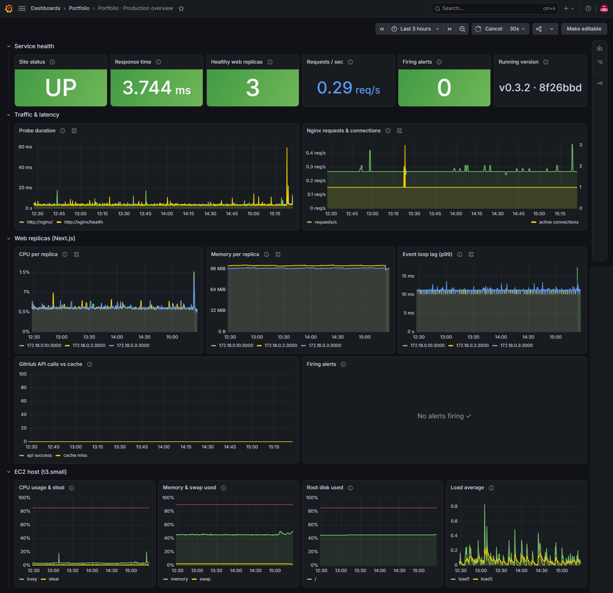

# Wisnu · Cloud Automation & Release Engineer

[](https://github.com/ngurahgdewisnugk/wisnu-portofolio/actions/workflows/ci.yml)
[](https://github.com/ngurahgdewisnugk/wisnu-portofolio/actions/workflows/cd.yml)

Personal portfolio of **Ngurah Gede Wisnu**, built as the capstone project of the
Digital Skola Cloud Engineer Bootcamp (Batch 6). The site itself is the demo: every
change goes through a CI/CD pipeline before it reaches an AWS EC2 server, where it
runs behind a load balancer with monitoring, alerting and manual scaling.

| | |
| --- | --- |
| 🌍 Live site | **http://3.105.161.228** (health: [`/health`](http://3.105.161.228/health), running commit: [`/version`](http://3.105.161.228/version)) |
| 🔧 Pipelines | [CI runs](https://github.com/ngurahgdewisnugk/wisnu-portofolio/actions/workflows/ci.yml) · [CD runs](https://github.com/ngurahgdewisnugk/wisnu-portofolio/actions/workflows/cd.yml) |
| 📈 Monitoring | Grafana dashboard as code, 9 alert rules ([screenshot](#monitoring--logging)) |
| 🛑 Merge gate proof | [PR #7](https://github.com/ngurahgdewisnugk/wisnu-portofolio/pull/7): failing test, merge blocked, closed unmerged |

## Contents

- [Project checklist](#project-checklist)
- [Architecture](#architecture)
- [Tech stack](#tech-stack)
- [CI pipeline](#ci-pipeline) · [CD pipeline](#cd-pipeline)
- [Monitoring & logging](#monitoring--logging) · [Scaling](#scaling)
- [Security measures](#security-measures)
- [Measured in production](#measured-in-production)
- [Troubleshooting](#troubleshooting)
- [Run locally](#run-locally) · [Endpoints](#endpoints) · [Environment variables](#environment-variables)
- [Cost and teardown](#cost-and-teardown) · [Credits](#credits)

## Project checklist

| Requirement | Where it is |
| --- | --- |
| CI/CD: build, test, deploy | [`ci.yml`](.github/workflows/ci.yml) (6 jobs) → [`cd.yml`](.github/workflows/cd.yml) (build, scan, push, deploy to EC2), see [CI](#ci-pipeline) and [CD](#cd-pipeline) |
| Deployment to the cloud | AWS EC2 t3.small in `ap-southeast-2` (Sydney), Docker Compose, image from GHCR by digest, runbook in [docs/deployment.md](docs/deployment.md) |
| Security (optional) | No secrets in git, GitHub OIDC instead of AWS keys, SSH opened per deploy for the runner only, 4 security scanners as gates, see [Security measures](#security-measures) |
| Monitoring (logs + dashboard) | Prometheus + Grafana dashboard (21 panels) + JSON access logs, see [Monitoring & logging](#monitoring--logging) and [docs/monitoring.md](docs/monitoring.md) |
| Scaling (optional) | Manual horizontal scaling through the pipeline (`WEB_REPLICAS`, 1–3), production runs **3 replicas**, see [Scaling](#scaling) |
| Documentation | This README, [docs/deployment.md](docs/deployment.md), [docs/monitoring.md](docs/monitoring.md), [CHANGELOG.md](CHANGELOG.md) |

## Architecture



A change travels one way only: pull request → CI → merge to `main` → CI again on
`main` → CD. Only port 80 is open to the internet; Grafana and Prometheus are bound
to `127.0.0.1` and reached through an SSH tunnel.

## Tech stack

| Layer | Tools |
| --- | --- |
| App | Next.js 15 (Pages Router + API routes), TypeScript, Tailwind CSS |
| Tests | Vitest, ESLint, `tsc` |
| Container | Docker multi-stage build, Next.js standalone output, Node 22 Alpine |
| CI/CD | GitHub Actions, GitHub Container Registry (GHCR), GitHub OIDC → AWS IAM |
| Cloud | AWS EC2 (Ubuntu 24.04), Elastic IP, security group, AWS Budgets |
| Runtime | Docker Compose, Nginx (reverse proxy + load balancer) |
| Observability | Prometheus, Grafana (dashboard as code), node_exporter, blackbox_exporter, nginx-prometheus-exporter, `prom-client` app metrics, JSON access logs |

## CI pipeline

`.github/workflows/ci.yml` runs on every push and on pull requests to `main`.
It never deploys. All jobs must pass before a change can be merged: the `protect-main`
ruleset requires a pull request and the checks, with no force push and no bypass.

| Job | What it checks | Fails when |
| --- | --- | --- |
| Lint, typecheck, test, build | ESLint, `tsc --noEmit`, Vitest, `next build` | any error or lint warning |
| Dependency audit | `npm audit` against `package-lock.json` | any HIGH/CRITICAL advisory |
| SAST (Semgrep) | `p/javascript`, `p/typescript`, `p/react`, `p/secrets` | any ERROR-severity finding |
| Secret scan (gitleaks) | every commit in the git history | any secret found |
| Docker build, scan, smoke test | multi-stage build, Trivy image scan, container run | fixable HIGH/CRITICAL CVE or secret in the image, `/version` ≠ commit SHA, or container runs as root |
| Deploy & monitoring config | `docker compose config`, `promtool check config`, `promtool test rules`, blackbox `--config.check`, `nginx -t`, dashboard JSON checks, `shellcheck` (same image tags as production) | any invalid config, failing alert rule test, or shell issue |

Supply-chain hardening: every third-party action is pinned to a full commit SHA,
and downloaded tools (gitleaks, Trivy) are checked against their published checksums.

**The gate works:** [PR #7](https://github.com/ngurahgdewisnugk/wisnu-portofolio/pull/7)
added a deliberately failing unit test (`expected 200 to be 201`). CI went red, the
Docker job was skipped, GitHub reported *"Merging is blocked due to failing merge
requirements"*, and the PR was closed without merging.

## CD pipeline

`.github/workflows/cd.yml` runs only after CI succeeds on `main` (or manually on `main`).
Pull requests never reach it. Full runbook: [docs/deployment.md](docs/deployment.md).

| Job | Steps |
| --- | --- |
| Build, scan, push image | build the exact commit CI tested, Trivy scan, push `:<sha>` and `:latest` to GHCR |
| Deploy to EC2 | assume an AWS role via OIDC, open SSH for the runner's IP only, upload compose files, `deploy.sh` with automatic rollback, check that every Prometheus target is up, public smoke test, close SSH |

The image is deployed by digest (`image@sha256:…`), so what runs is exactly what was
scanned. `deploy.sh` rolls back to the previous image if a container is unhealthy or
`/version` does not report the new commit, and the smoke test fails the run if
`/api/metrics`, `:9090` or `:3001` answer from the internet.

## Monitoring & logging



*Grafana "Portfolio · Production overview", 30 Sep 2026, v0.3.2 · `8f26bbd`: site UP,
3 healthy web replicas (one line per replica in the CPU, memory and event loop panels),
no alerts firing.*

Prometheus scrapes every web replica (discovered through Docker DNS), the EC2 host
(node_exporter), Nginx (stub_status) and synthetic HTTP probes of `/` and `/health`
(blackbox_exporter). Grafana shows one provisioned dashboard (21 panels): service
health, traffic and latency, per-replica CPU/memory/event loop lag, and host CPU,
steal, memory and disk. Nine [alert rules](deploy/monitoring/prometheus/rules) (site down, no
healthy replica, slow site, host pressure, event loop lag) are unit tested in CI.

Grafana is the only UI, opened through an SSH tunnel; Prometheus is a backend for
Grafana and for the deploy check, never exposed. Every deploy checks that all
targets are up (9 targets with 3 replicas).

Logs: Nginx writes one JSON line per request (status, latency, upstream replica), all
containers rotate at 10 MB × 3, and deployments and rollbacks are recorded on the server.

Details, tunnel command, alert list and log queries: [docs/monitoring.md](docs/monitoring.md).

## Scaling

Manual horizontal scaling through the pipeline: set the GitHub environment variable
`WEB_REPLICAS` (1–3, default 2) and re-run CD. Production currently runs **3**.
Nginx spreads traffic across all replicas and Prometheus picks up the new targets
automatically; the deploy fails if the number of scraped web targets does not match
the number of containers (CD log: `3/3 web replicas scraped`).

The ceiling of 3 comes from the memory budget of the t3.small (see
[Measured in production](#measured-in-production)). The next steps would be vertical
(a larger instance) or an Auto Scaling group behind an AWS load balancer, with
monitoring moved off the app host. Details:
[docs/monitoring.md#scaling](docs/monitoring.md#scaling).

## Security measures

- No secrets in the repo: runtime values come from GitHub environment secrets and are
  written to the server over SSH stdin (never as command-line arguments).
- No long-lived AWS keys: GitHub OIDC with a role that can only toggle port 22 on one
  security group, and only from the `production` environment of this repo.
- SSH is closed to the internet; each deploy opens it for the runner's /32 and closes it again.
  The server's host key is pinned (`StrictHostKeyChecking yes`).
- Separate `deploy` user and key for the pipeline; admin access uses a different key.
- Gates in CI and CD: `npm audit`, Semgrep, gitleaks, Trivy. Actions pinned to commit SHAs.
- Container runs as non-root with all Linux capabilities dropped and `no-new-privileges`.
- `/api/metrics` is blocked at Nginx; API routes are rate limited.
- Prometheus and Grafana bind to `127.0.0.1` on the host (Grafana through an SSH tunnel);
  exporters have no host ports.
- EC2: IMDSv2 only, encrypted EBS, CPU credits in `standard` mode, budget alert.

## Measured in production

Numbers from the running server on 30 Sep 2026 (t3.small: 2 GiB RAM + 2 GiB swap).

| What | Result |
| --- | --- |
| Web replicas | 3, each ~96 MiB (limit 384 MiB) |
| Host memory with 3 replicas + monitoring | 841 MiB available, 30 MiB swap in use |
| Grafana (limit 768 MiB) | working set ~313 MiB (`anon` ~219 + `active_file` ~94 MiB); limit hit 0 times in ~12 hours (cgroup `memory.events` `max 0`) |
| Response time (blackbox probe) | a few ms, one spike to ~60 ms in 3 hours |
| Host CPU | mostly under 5% busy, no steal |
| Prometheus targets | 9 up (3 web replicas, Nginx, host, blackbox exporter, 2 HTTP probes, Prometheus) |

How memory is measured (and why `docker stats` is not enough): see
[docs/monitoring.md#why-the-ceiling-is-3](docs/monitoring.md#why-the-ceiling-is-3).

## Troubleshooting

Real problems hit while building this, and how they were fixed. Full commands are in
[docs/deployment.md#troubleshooting](docs/deployment.md#troubleshooting).

| # | Symptom | Cause | Fix |
| --- | --- | --- | --- |
| 1 | AWS resources created in the wrong region | AWS CloudShell pre-sets `AWS_REGION`, which beats `AWS_DEFAULT_REGION` | `aws-setup.sh` pins both from `REGION` (default `ap-southeast-2`) |
| 2 | CD: `Could not load credentials from any providers` | `AWS_DEPLOY_ROLE_ARN` resolved to empty, so `role-to-assume` was blank | Saved as an environment secret of `production` with the exact name; the log must show `role-to-assume: ***` |
| 3 | CD: `Not authorized to perform sts:AssumeRoleWithWebIdentity` | New repos send an immutable OIDC subject (`repo:owner@<id>/repo@<id>:…`), so the name-only trust policy never matched | Found the real subject in CloudTrail; `aws-setup.sh` now builds it from the numeric IDs |
| 4 | CD: `No ED25519 host key is known … strict checking` | `EC2_KNOWN_HOSTS` secret was malformed | Regenerated with `ssh-keyscan` into a file, tested with a strict dry-run SSH, then `gh secret set < file` |
| 5 | Grafana kept loading in the browser, but `curl` on the server answered in ms | The SSH tunnel had died after the home IP changed (admin SG rule still had the old IP) | Updated the admin rule; tunnel now uses `ServerAliveInterval` + `ExitOnForwardFailure` |
| 6 | Grafana slow, no OOM kill, no restarts | Memory limit too small: cgroup `memory.events` showed `max 33107` in ~8 hours. `docker stats` hid it because it counts file cache | Measured the working set from `memory.stat`, raised the limit 256 → 512 → 768 MiB; now `max 0` |
| 7 | `nginx.conf` changes did not take effect after deploy | The Nginx container is not recreated when only a mounted config changes | `deploy.sh` runs `nginx -t` and reloads Nginx (and Prometheus) on every deploy |
| 8 | Prometheus UI would not load through the tunnel | Two UIs through one tunnel was fragile and not needed | Grafana is the only UI: Explore for queries, Alerting for rules (`manageAlerts`); Prometheus stays a backend |

## Run locally

Requirements: Node.js 22 (see `.nvmrc`) and Docker.

```bash
cp .env.example .env        # optional: add a read-only GitHub token
npm ci
npm run dev                 # http://localhost:3000
```

Quality checks (same commands the CI pipeline runs):

```bash
npm run lint
npm run typecheck
npm test
npm run build
```

Run the production container:

```bash
docker build \
  --build-arg GIT_SHA=$(git rev-parse HEAD) \
  --build-arg BUILD_TIME=$(date -u +%Y-%m-%dT%H:%M:%SZ) \
  --build-arg VERSION=$(node -p "require('./package.json').version") \
  -t wisnu-portofolio:local .

docker run --rm -p 3000:3000 --env-file .env wisnu-portofolio:local
```

## Endpoints

| Path | Purpose |
| --- | --- |
| `/` · `/projects` · `/contact` | Portfolio pages |
| `/health` | Liveness probe (`{"status":"ok", ...}`) |
| `/version` | Semver + full commit SHA of the running image |
| `/api/metrics` | Prometheus metrics (blocked from the internet by Nginx) |
| `/api/github/projects` | Repos tagged `portfolio-project` (owner locked by config) |
| `/api/github/contributions` | Contribution calendar (needs `GITHUB_TOKEN`) |

## Environment variables

Names only; values live in `.env` locally and in GitHub Secrets in CI.

| Name | Required | Description |
| --- | --- | --- |
| `GITHUB_USERNAME` | No | GitHub owner for the Projects page (defaults to `src/data/profile.ts`) |
| `GITHUB_TOKEN` | No | Read-only token; raises rate limits and enables the contributions chart |

Set by the pipeline on the server only (GitHub environment `production`):

| Name | Kind | Description |
| --- | --- | --- |
| `WEB_REPLICAS` | variable | Number of Next.js replicas, 1–3 (default 2, production 3) |
| `GRAFANA_ADMIN_PASSWORD` | secret | Grafana admin password, 16+ letters/digits; written to a file only Grafana reads |

AWS and SSH values (`AWS_DEPLOY_ROLE_ARN`, `EC2_SSH_KEY`, `EC2_KNOWN_HOSTS`,
`EC2_HOST`, `EC2_SG_ID`) are listed in [docs/deployment.md](docs/deployment.md#4-github-environment-production).

## Adding a project to the site

Add the topic `portfolio-project` to any public repo on GitHub. Add `highlight`
as well to feature it on the home page. No redeploy needed (cache: 15 minutes).

## Cost and teardown

One t3.small with a 20 GB encrypted gp3 volume and an Elastic IP, CPU credits in
`standard` mode so there is no surplus-credit charge, and an AWS Budgets alert
(USD 10/month, email at 80%).
Monitoring runs on the same instance, so it adds no AWS cost.

Everything is created and removed by scripts in [`infra/`](infra/):

```bash
REGION=ap-southeast-2 bash aws-teardown.sh   # instance, volume, Elastic IP, SG, role, key, budget
```

## Credits

Based on [adamsnows/developer-portfolio](https://github.com/adamsnows/developer-portfolio)
(MIT). Content, security fixes, tests, container, pipeline and monitoring are my own
work; see [CHANGELOG.md](CHANGELOG.md).
