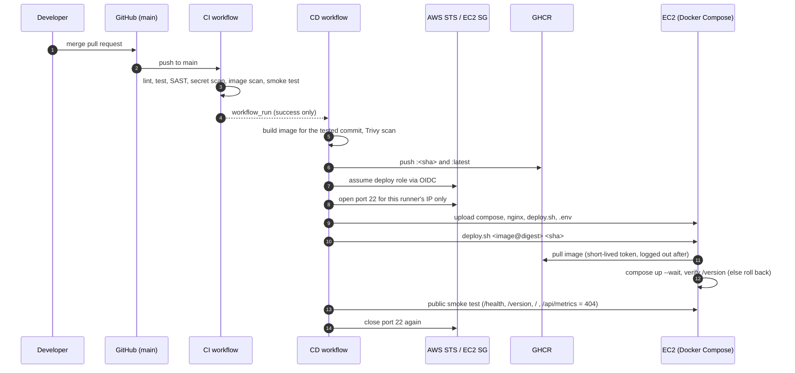

# Deployment runbook

How the portfolio gets from a merged pull request to a running container on AWS,
and how to set up, operate, roll back, and tear down the environment.

## How a release flows



## One-time setup

### 1. Keys (on your laptop)

```bash
ssh-keygen -t ed25519 -f ~/.ssh/portfolio-admin  -C "portfolio-admin"
ssh-keygen -t ed25519 -f ~/.ssh/portfolio-deploy -C "github-actions-deploy" -N ""
curl -fsS https://checkip.amazonaws.com   # your public IP for admin SSH
```

The admin key is for you (use a passphrase). The deploy key is for the pipeline
only; it lands on the `deploy` user, which cannot forward ports or agents.

### 2. AWS resources (AWS CloudShell, region ap-southeast-2 / Sydney)

The scripts pin the region themselves (CloudShell pre-sets `AWS_REGION` to the
console's region, which would otherwise take precedence).

```bash
curl -fsSLO https://raw.githubusercontent.com/ngurahgdewisnugk/wisnu-portofolio/main/infra/aws-setup.sh
curl -fsSLO https://raw.githubusercontent.com/ngurahgdewisnugk/wisnu-portofolio/main/infra/user-data.sh
export MY_IP="<your-ip>"
export ADMIN_PUBKEY="<contents of portfolio-admin.pub>"
export DEPLOY_PUBKEY="<contents of portfolio-deploy.pub>"
export ALERT_EMAIL="<you@example.com>"    # optional budget alert
bash aws-setup.sh
```

| Resource | Setting |
| --- | --- |
| EC2 | `t3.small`, Ubuntu 24.04, 20 GB gp3 encrypted, IMDSv2 only, CPU credits `standard` (no surprise charges) |
| Security group | 80 open to the internet; 22 only from `MY_IP`; the pipeline adds its own /32 per run |
| Elastic IP | stable address for the pipeline, README and graders across stop/start |
| IAM | GitHub OIDC provider + role trusted only by `repo:ngurahgdewisnugk/wisnu-portofolio:environment:production`, allowed only to add/remove ingress on that one security group |
| Budget | USD 10/month, email at 80% (optional) |

### 3. Verify the server and pin its host key (laptop)

```bash
ssh -i ~/.ssh/portfolio-admin ubuntu@<EC2_HOST> 'cloud-init status --wait && docker --version && docker compose version'
ssh-keyscan -t ed25519 <EC2_HOST> 2>/dev/null   # value for EC2_KNOWN_HOSTS
```

### 4. GitHub environment `production`

Settings → Environments → New environment `production`
→ Deployment branches and tags: **Selected branches** → `main`.

| Kind | Name | Value |
| --- | --- | --- |
| Variable | `EC2_HOST` | Elastic IP from step 2 |
| Variable | `EC2_SG_ID` | security group ID from step 2 |
| Secret | `AWS_DEPLOY_ROLE_ARN` | role ARN from step 2 |
| Secret | `EC2_SSH_KEY` | contents of `~/.ssh/portfolio-deploy` (private key) |
| Secret | `EC2_KNOWN_HOSTS` | output of `ssh-keyscan` in step 3 |
| Secret | `GH_API_TOKEN` | optional, fine-grained read-only token for the GitHub API |

Also allow `aws-actions/configure-aws-credentials@e1253824e5c10ff9df46874f81ed3ec929e19cfd`
in Settings → Actions → General.

## Operating

| Task | How |
| --- | --- |
| Deploy | Merge a PR into `main`. CD starts when CI passes. |
| Redeploy current `main` | Actions → CD → Run workflow (branch `main`). |
| See what is live | `http://<EC2_HOST>/version`, or the footer of the site. |
| Deployment history | GitHub → Environments → production; on the server `/opt/portfolio/.deploy/history.log`. |
| Logs | `ssh -i ~/.ssh/portfolio-admin ubuntu@<EC2_HOST>` then `sudo docker compose --project-directory /opt/portfolio logs -f` |
| Roll back | Automatic when a new release is unhealthy. Manually: revert the commit through a PR. |
| Save money | EC2 → Stop instance. The Elastic IP keeps the address; start it again before a demo. |

## Teardown (after grading)

```bash
curl -fsSLO https://raw.githubusercontent.com/ngurahgdewisnugk/wisnu-portofolio/main/infra/aws-teardown.sh
bash aws-teardown.sh
```

Removes the instance and its volume, **releases the Elastic IP** (idle EIPs are still
billed), and deletes the security group, role, key pair and budget. Then delete the
`production` environment secrets and, if unused, the GHCR package.
