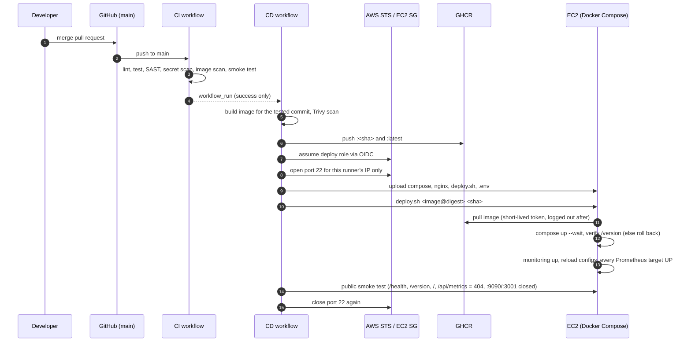

# Deployment runbook

How the portfolio gets from a merged pull request to a running container on AWS,
and how to set up, operate, roll back, and tear down the environment.

## How a release flows



## One-time setup

### 1. Keys (on your laptop)

```bash
ssh-keygen -t ed25519 -f ~/.ssh/portfolio-admin  -C "portfolio-admin"
ssh-keygen -t ed25519 -f ~/.ssh/portfolio-deploy -C "github-actions-deploy" -N ""
curl -fsS https://checkip.amazonaws.com   # your public IP for admin SSH
```

The admin key is for you (use a passphrase). The deploy key is for the pipeline
only; it lands on the `deploy` user, which cannot forward ports or agents.

### 2. AWS resources (AWS CloudShell, region ap-southeast-2 / Sydney)

The scripts pin the region themselves (CloudShell pre-sets `AWS_REGION` to the
console's region, which would otherwise take precedence).

```bash
curl -fsSLO https://raw.githubusercontent.com/ngurahgdewisnugk/wisnu-portofolio/main/infra/aws-setup.sh
curl -fsSLO https://raw.githubusercontent.com/ngurahgdewisnugk/wisnu-portofolio/main/infra/user-data.sh
export MY_IP="<your-ip>"
export ADMIN_PUBKEY="<contents of portfolio-admin.pub>"
export DEPLOY_PUBKEY="<contents of portfolio-deploy.pub>"
export ALERT_EMAIL="<you@example.com>"    # optional budget alert
bash aws-setup.sh
```

| Resource | Setting |
| --- | --- |
| EC2 | `t3.small`, Ubuntu 24.04, 20 GB gp3 encrypted, IMDSv2 only, CPU credits `standard` (no surprise charges) |
| Security group | 80 open to the internet; 22 only from `MY_IP`; the pipeline adds its own /32 per run |
| Elastic IP | stable address for the pipeline, README and graders across stop/start |
| IAM | GitHub OIDC provider + role trusted only by `repo:ngurahgdewisnugk@<owner_id>/wisnu-portofolio@<repo_id>:environment:production` (immutable subject, IDs looked up automatically), allowed only to add/remove ingress on that one security group |
| Budget | USD 10/month, email at 80% (optional) |

### 3. Verify the server and pin its host key (laptop)

```bash
ssh -i ~/.ssh/portfolio-admin ubuntu@<EC2_HOST> 'cloud-init status --wait && docker --version && docker compose version'
ssh-keyscan -t ed25519 <EC2_HOST> 2>/dev/null > /tmp/known_hosts
ssh-keygen -lf /tmp/known_hosts                   # must match the fingerprint you accepted above

# dry run exactly like the pipeline: strict host checking + deploy key only
ssh -o UserKnownHostsFile=/tmp/known_hosts -o StrictHostKeyChecking=yes \
    -i ~/.ssh/portfolio-deploy -o IdentitiesOnly=yes deploy@<EC2_HOST> true && echo OK
```

Store the file as the secret without copy-paste:
`gh secret set EC2_KNOWN_HOSTS --env production < /tmp/known_hosts`

### 4. GitHub environment `production`

Settings → Environments → New environment `production`
→ Deployment branches and tags: **Selected branches** → `main`.

| Kind | Name | Value |
| --- | --- | --- |
| Variable | `EC2_HOST` | Elastic IP from step 2 |
| Variable | `EC2_SG_ID` | security group ID from step 2 |
| Secret | `AWS_DEPLOY_ROLE_ARN` | role ARN from step 2 |
| Secret | `EC2_SSH_KEY` | contents of `~/.ssh/portfolio-deploy` (private key) |
| Secret | `EC2_KNOWN_HOSTS` | output of `ssh-keyscan` in step 3 |
| Secret | `GH_API_TOKEN` | optional, fine-grained read-only token for the GitHub API |
| Secret | `GRAFANA_ADMIN_PASSWORD` | 16+ letters/digits: `openssl rand -hex 16` |
| Variable | `WEB_REPLICAS` | optional, 1–3 (default 2): number of Next.js replicas |

Also allow `aws-actions/configure-aws-credentials@e1253824e5c10ff9df46874f81ed3ec929e19cfd`
in Settings → Actions → General.

## Operating

| Task | How |
| --- | --- |
| Deploy | Merge a PR into `main`. CD starts when CI passes. |
| Redeploy current `main` | Actions → CD → Run workflow (branch `main`). |
| See what is live | `http://<EC2_HOST>/version`, or the footer of the site. |
| Deployment history | GitHub → Environments → production; on the server `/opt/portfolio/.deploy/history.log`. |
| Logs | `ssh -i ~/.ssh/portfolio-admin ubuntu@<EC2_HOST>` then `sudo docker compose --project-directory /opt/portfolio logs -f` (JSON queries: [monitoring.md](monitoring.md#logging)) |
| Dashboard | SSH tunnel to `127.0.0.1:3001`, see [monitoring.md](monitoring.md#open-the-dashboard) |
| Scale | Set variable `WEB_REPLICAS` (1–3), then Actions → CD → Run workflow |
| Roll back | Automatic when a new release is unhealthy. Manually: revert the commit through a PR. |
| Save money | EC2 → Stop instance. The Elastic IP keeps the address; start it again before a demo. |

## Troubleshooting

Real issues hit while setting this up, in the order they showed up.

| Symptom | Cause | Fix |
| --- | --- | --- |
| Resources created in the wrong region; deploy role policy points to another region's security group | CloudShell pre-sets `AWS_REGION` to the console's region, which beats `AWS_DEFAULT_REGION` | `aws-setup.sh` now exports both from `REGION` (default `ap-southeast-2`). Re-running it is safe and rewrites the role policy |
| `Could not load credentials from any providers`, and the step's `with:` block shows no `role-to-assume` | `secrets.AWS_DEPLOY_ROLE_ARN` resolved to empty (saved as a variable, wrong name, or wrong secret scope), so the action fell back to the default credential chain | Save it as an **environment secret** of `production`, exact name. In the log it must appear as `role-to-assume: ***` |
| `Not authorized to perform sts:AssumeRoleWithWebIdentity` | Repos created on or after 15 July 2026 send an immutable subject `repo:owner@<id>/repo@<id>:...`; a trust policy with the name-only form never matches | Check the real subject in CloudTrail (below), then re-run `aws-setup.sh`, which now builds the subject from the numeric IDs |
| `No ED25519 host key is known for <host> and you have requested strict checking` | `EC2_KNOWN_HOSTS` is malformed (fingerprint instead of key, truncated line, placeholder) | Regenerate with `ssh-keyscan` into a file, run the dry-run SSH in step 3, then `gh secret set ... < file` |
| Admin SSH times out, pipeline still works | Home IP changed; port 22 for admins only allows the old `MY_IP` | Update the admin rule on the security group. The pipeline opens its own /32 per run and is unaffected |
| Grafana and Prometheus keep loading in the browser, but `curl` against `127.0.0.1:3001` / `:9090` on the server answers in milliseconds | The SSH tunnel on the laptop had exited: `ss -ltnp` showed nothing listening on 3001/9090 and `curl` there failed instantly (`000`) | Reopen the tunnel with keep-alive and fail-fast options (see [monitoring.md](monitoring.md#open-the-dashboard)). Check with `ss -ltnp \| grep -E ':(3001\|9090) '` |
| Found while investigating the row above: Grafana at 87% of its 256 MiB limit, no OOM kill, no restarts | Its cgroup `memory.events` showed `max 33107` and `sock_throttled 9443` after ~8 hours: constant reclaim near the limit, invisible in `docker ps` | Raised `mem_limit` to 512 MiB (measured usage ~225 MiB). Check any container with `sudo cat /sys/fs/cgroup/system.slice/docker-$(sudo docker inspect -f '{{.Id}}' <name>).scope/memory.events` |

Find the subject GitHub actually sent (CloudShell, events appear after ~5–15 minutes):

```bash
aws cloudtrail lookup-events --region ap-southeast-2 \
  --lookup-attributes AttributeKey=EventName,AttributeValue=AssumeRoleWithWebIdentity \
  --max-results 1 --query 'Events[0].CloudTrailEvent' --output text \
  | jq -r '.userIdentity.userName, .errorCode'
```

After a failed run, confirm the per-run SSH rule was removed (only the admin IP should remain):

```bash
aws ec2 describe-security-groups --group-ids <EC2_SG_ID> \
  --query 'SecurityGroups[0].IpPermissions[?ToPort==`22`].IpRanges[].CidrIp' --output text
```

## Teardown (after grading)

```bash
curl -fsSLO https://raw.githubusercontent.com/ngurahgdewisnugk/wisnu-portofolio/main/infra/aws-teardown.sh
bash aws-teardown.sh
```

Removes the instance and its volume, **releases the Elastic IP** (idle EIPs are still
billed), and deletes the security group, role, key pair and budget. Then delete the
`production` environment secrets and, if unused, the GHCR package.
