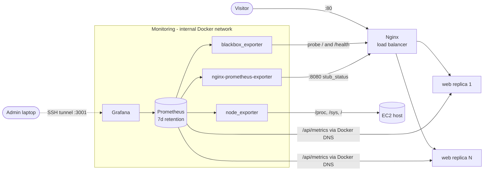

# Monitoring, logging and scaling

Everything here runs on the same EC2 instance as the app, is deployed by the same
CD pipeline, and is defined in git (`deploy/monitoring/`). Nothing is exposed to the
internet: the only public port is still 80.

## Architecture



| Component | Image | Role | Reachable from |
| --- | --- | --- | --- |
| Prometheus | `prom/prometheus:v3.13.4` (LTS) | scrapes every 15s, evaluates alert rules, keeps 7 days / max 1 GB. Backend only: its UI is not needed | Grafana, and `deploy.sh` through `127.0.0.1:9090` on the host |
| Grafana | `grafana/grafana:13.2.3` | the only UI: dashboard, ad-hoc queries, alert rules; provisioned from git | `127.0.0.1:3001` on the host (SSH tunnel) |
| node_exporter | `prom/node-exporter:v1.12.1` | CPU, steal, memory, swap, disk, load of the instance | Docker network only |
| blackbox_exporter | `prom/blackbox-exporter:v0.28.0` | synthetic HTTP checks of `/` and `/health` through Nginx | Docker network only |
| nginx-prometheus-exporter | `nginx/nginx-prometheus-exporter:1.5.3` | Nginx request and connection counters (`stub_status`) | Docker network only |
| App metrics | `prom-client` in Next.js | `/api/metrics` on each replica: build info, process CPU/memory, event loop lag, GitHub API and cache counters | Docker network only (Nginx returns 404 from the internet) |

Web replicas are discovered through Docker's embedded DNS (`dns_sd_configs` on the
service name `web`), so scaling up or down adds or removes scrape targets without
touching the Prometheus config.

## Open the dashboard

Grafana is the only UI; one tunnel to port 3001 is enough. Admin SSH is allowed only
from your own IP (`MY_IP` in `aws-setup.sh`; update the security group rule when your
IP changes). The `deploy` user cannot forward ports, so use the admin key:

```bash
ssh -i ~/.ssh/portfolio-admin -N \
    -o ServerAliveInterval=30 -o ServerAliveCountMax=3 -o ExitOnForwardFailure=yes \
    -L 3001:127.0.0.1:3001 \
    ubuntu@<EC2_HOST>
```

Keep that terminal open; the tunnel lives only as long as the command runs. The
keep-alive options stop idle drops, and `ExitOnForwardFailure` makes it fail loudly if the
local port is already taken. If pages stop loading, first check the tunnel is still
listening: `ss -ltnp | grep ':3001 '` (Linux/WSL) or `netstat -ano | findstr :3001` (Windows).

Then open <http://localhost:3001> and sign in with the Grafana admin account (created at
first start from `GRAFANA_ADMIN_PASSWORD`). Everything the Prometheus UI offered is here:

| Need | In Grafana |
| --- | --- |
| Overall health | Home: **Portfolio · Production overview** dashboard |
| Scrape targets (was Prometheus `/targets`) | **Explore** → Prometheus → query `up` → **Table** view: one row per target, value `1` = up |
| Ad-hoc PromQL (was Prometheus `/query`) | **Explore** → Prometheus |
| Alert rules and their state (was Prometheus `/alerts`) | **Alerting → Alert rules** (data source-managed rules from Prometheus), and the dashboard's *Firing alerts* panels |

Without a browser, the same target list is one command on the server:
`curl -s 127.0.0.1:9090/api/v1/targets | jq -r '.data.activeTargets[] | "\(.labels.job)\t\(.labels.instance)\t\(.health)"'`.

Grafana applies `GF_SECURITY_ADMIN_PASSWORD` only when its database is created (first
start). To rotate it later, use Profile → Change password in Grafana, or
`sudo docker compose --project-directory /opt/portfolio exec grafana grafana cli admin reset-admin-password <new>`,
then update the secret too.

## Dashboard

`deploy/monitoring/grafana/dashboards/portfolio-overview.json`, loaded by Grafana's file
provider. It is read-only in the UI: change the JSON in git and let the pipeline deploy it.

| Row | Panels | Answers |
| --- | --- | --- |
| Service health | site status (UP/DOWN), response time, healthy web replicas, requests/s, firing alerts, running version | Is the site up, and which commit is serving? |
| Traffic & latency | probe duration per URL, Nginx requests/s and active connections | How fast, how busy? |
| Web replicas | CPU, memory (vs 384 MiB limit), event loop lag p99 per replica; GitHub API calls vs cache; firing alerts table | Is any replica saturated? Is the cache working? |
| EC2 host | CPU busy and **steal**, memory and swap, root disk, load average | Is the t3.small itself the bottleneck (or out of CPU credits)? |

These cover the four golden signals: latency (probe duration), traffic (Nginx
requests/s), errors (probe success, target down) and saturation (CPU, memory,
event loop lag, steal).

## Alerts

Rules: `deploy/monitoring/prometheus/rules/alerts.yml`, unit tested with
`promtool test rules` in CI.

| Alert | Fires when | Severity |
| --- | --- | --- |
| `SiteDown` | a blackbox probe fails for 2 minutes | critical |
| `NoHealthyWebReplica` | no web replica can be scraped for 1 minute | critical |
| `SiteSlow` | a probe takes more than 1s for 5 minutes | warning |
| `TargetDown` | any scrape target is down for 2 minutes | warning |
| `HostHighCpu` | CPU above 85% for 10 minutes | warning |
| `HostCpuStealHigh` | CPU steal above 10% for 10 minutes (out of t3 credits) | warning |
| `HostLowMemory` | less than 10% memory available for 5 minutes | warning |
| `HostDiskAlmostFull` | root filesystem less than 15% free for 10 minutes | warning |
| `EventLoopLagHigh` | event loop p99 lag above 200ms for 5 minutes | warning |

Trade-off: there is no Alertmanager, so alerts are **visible** (Grafana's Alerting page
and the dashboard) but not **sent** anywhere. Adding Alertmanager with an email or
Slack receiver is the next step; it was left out to keep the 2 GB instance within
its memory budget.

## Logging

| Source | Format | Where |
| --- | --- | --- |
| Nginx access log | JSON, one line per request (status, latency, upstream replica, user agent) | container stdout |
| Nginx error log | text | container stderr |
| Next.js replicas | stdout/stderr | container stdout |
| Deployments | `deploy` / `rollback` lines with timestamp, commit, image | `/opt/portfolio/.deploy/history.log` |
| Pipeline | every step, plus a job summary table | GitHub Actions run |

All containers use the `json-file` driver with rotation (10 MB × 3 files), so logs
cannot fill the disk. Useful queries on the server:

```bash
cd /opt/portfolio
sudo docker compose logs -f --tail 50 nginx web                   # follow everything
sudo docker compose logs nginx --since 1h --no-log-prefix \
  | jq -c 'select(.status >= 400)'                                  # only errors
sudo docker compose logs nginx --since 1h --no-log-prefix \
  | jq -r '.upstream_addr' | sort | uniq -c                         # requests per replica
cat .deploy/history.log                                            # deploy / rollback history
```

Trade-off: logs stay on the instance (no Loki/CloudWatch). A log backend would need
another 200–300 MB of RAM on a 2 GB host; the JSON format means it can be added
later without changing Nginx.

## Scaling

### Manual horizontal scaling (declarative, through the pipeline)

The number of Next.js replicas comes from the GitHub variable `WEB_REPLICAS`
(environment `production`, allowed values 1–3, default 2):

1. Settings → Environments → `production` → Variables → `WEB_REPLICAS` = `3`.
2. Actions → CD → Run workflow (branch `main`).
3. The pipeline writes it to `/opt/portfolio/.env`, Compose starts the extra replica,
   `deploy.sh` checks that Prometheus scrapes exactly as many web targets as there are
   containers, and the job summary shows the replica count.
4. On the dashboard, **Healthy web replicas** goes from 2 to 3, and the per-replica
   panels show a third line.

Nothing else changes: Nginx re-resolves `web` every 10 seconds and spreads requests
across all replicas, and Prometheus discovers the new one through Docker DNS.

For a quick experiment on the server (reverted by the next deploy):

```bash
cd /opt/portfolio
sudo APP_IMAGE="$(cat .deploy/current_image)" docker compose up -d --scale web=3 --no-recreate web
```

### Why the ceiling is 3

Memory on the t3.small (2 GiB RAM + 2 GiB swap), measured in production with 2 replicas:

| Service | Limit | Measured working set |
| --- | --- | --- |
| web, per replica | 384 MiB | ~50–100 MiB (grows after start, see the dashboard) |
| Nginx | 64 MiB | ~6 MiB |
| Prometheus | 256 MiB | ~162 MiB (cgroup `max` events: 0) |
| Grafana | 768 MiB | ~450 MiB (~280 MiB process + ~160 MiB actively used files) |
| 3 exporters | 3 × 48 MiB | ~54 MiB together |
| **Total, 2 replicas / 3 replicas** | **2000 MiB / 2384 MiB** | **~865 MiB / ~965 MiB** |

With 2 replicas the host reported ~886 MiB available and ~56 MiB of swap in use, so a
third replica (~+100 MiB) fits. Limits are ceilings, not usage: their sum exceeds RAM
because the containers never peak together, and swap absorbs short bursts. The cap of 3
keeps that bet safe; the dashboard's memory panels show the real numbers.

How the Grafana number was measured: `docker stats` alone is misleading here, because on
cgroup v2 it includes file cache. The split comes from the container's cgroup files:

```bash
d=/sys/fs/cgroup/system.slice/docker-$(sudo docker inspect -f '{{.Id}}' portfolio-grafana-1).scope
sudo cat $d/memory.events        # "max" = times the limit was hit
sudo grep -E '^(anon|active_file|inactive_file) ' $d/memory.stat
```

`anon` is process memory; `active_file` is files in active use (evicting them costs disk
reads); `inactive_file` is cache the kernel can drop for free. A limit is right when `max`
stays near 0 with `anon + active_file` well below it.
Beyond 3 replicas the next steps are vertical (a larger instance type) or a second
instance behind an AWS load balancer with an Auto Scaling group, which would also move
monitoring off the app host.

## Evidence that the gates block

| Gate | How to show it |
| --- | --- |
| CI blocks a bad change | Open a throwaway PR that breaks a unit test (or an alert rule). CI goes red and the `protect-main` ruleset disables the merge button. Close the PR without merging and delete the branch. |
| CD only ships what CI passed | CD triggers on `workflow_run` with `conclusion == 'success'`; a red CI run never starts CD. |
| Deploy rolls back an unhealthy release | `deploy.sh` restarts the previous image digest if a container is unhealthy or `/version` does not match the commit. |
| Monitoring is verified on every deploy | `deploy.sh` fails the job (without rolling back the healthy app) if any Prometheus target is down or a web replica is not scraped. |
| Nothing internal is public | The CD smoke test fails if `/api/metrics`, `:9090` or `:3001` answer from the internet. |
